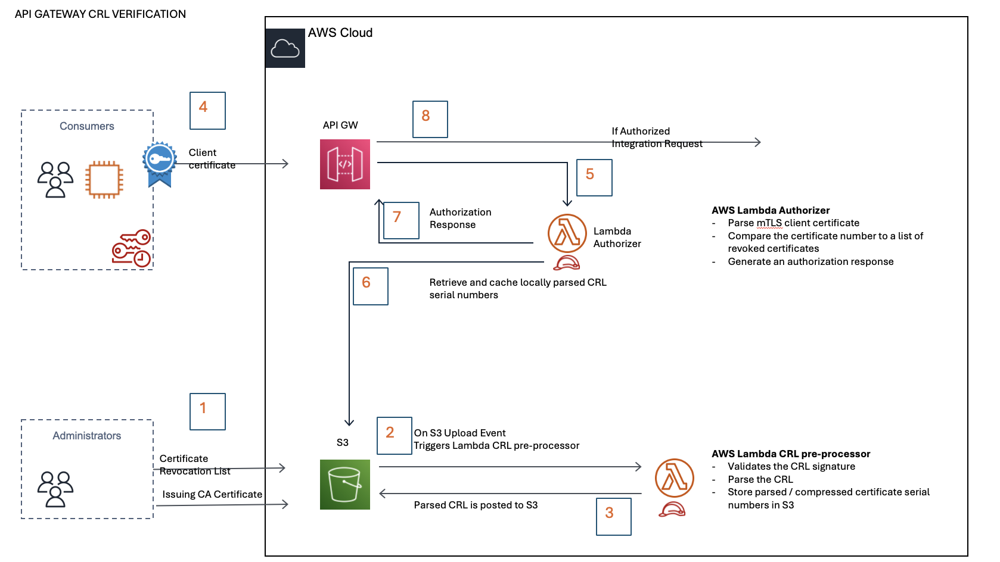
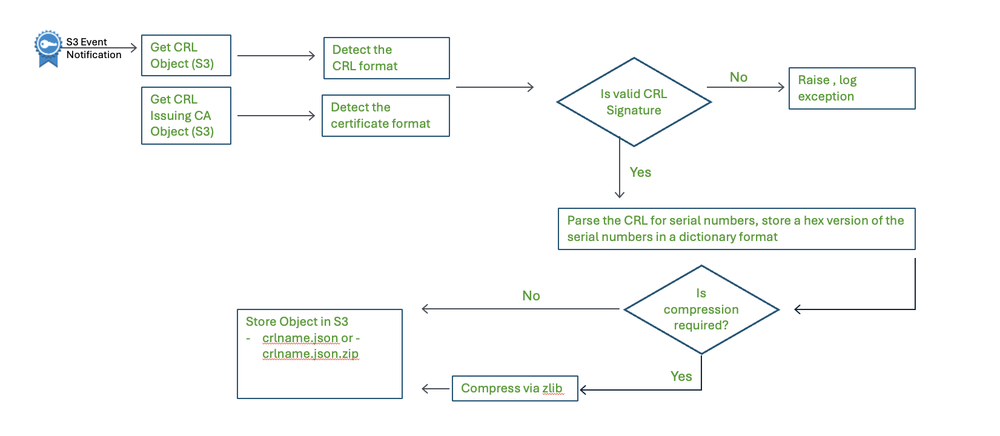
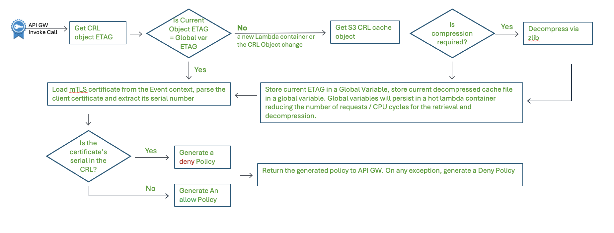

# How to implement client certificate revocation list checks at scale with API Gateway

## Introduction

This repository contains demonstration code related to the blog post published on the AWS Security Blog: [How to Implement Client Certificate Revocation List Checks at Scale with API Gateway](https://aws.amazon.com/blogs/security/how-to-implement-client-certificate-revocation-list-checks-at-scale-with-api-gateway/) by Arthur Mnev and Venkat Donavalli. This code is intended for development and demonstration purposes only and should never be used in a production system without thorough validation.

The instructions in this README file are complimentary to the blog post. We highly recommend reviewing both the blog post and these instructions prior to downloading or implementing the code.


⚠️ **IMPORTANT**: This code is a proof-of-concept and may contain bugs, non-descriptive error handling, and other issues typical of a demonstration environment. Use with care and caution.

## Prerequisites

Before deploying this solution, ensure you have:

1. An AWS account with appropriate permissions
2. AWS CLI installed and configured
3. A code distribution S3 bucket to store the source files

## Architecture



- An administrator publishes a Certificate Revocation List (CRL) and its signing CA’s certificate to their non-public S3 bucket accessible by the Lambda Authorizer and Pre-Processor roles

 - An S3 Event triggers AWS Lambda pre-processor execution on CRL upload. The function retrieves the CRL from S3, validates its signature against the issuing certificate, and parses it.

- Pre-processor AWS Lambda stores the results in the S3 bucket with <crlname>.cache.json name. The function may optionally compress the file.

- A TLS client requests an mTLS connection and supplies its certificate.

- API GW completes mTLS negotiation and triggers AWS Lambda Authorizer

- AWS Lambda Authorizer function parses the client’s mTLS certificate, retrieves the cached CRL object, and searches it for the serial number of the client’s certificate

- The authorizer function returns a deny policy if the certificate is revoked or in error.

- API Gateway, if authorized, proceeds with the integrated function or denies the client’s request

## Flow Chart

### CRL pre-processor (S3 / Lambda / Python)



### Lambda Authorizer  (CRL verification / Python) 



## Deployment

1. Clone this repository
    ```bash
    git clone https://github.com/aws-samples/api-gateway-crl-verification.git
    cd api-gateway-crl-verification
    ```
1. Set Environment Variables
    ```bash
    export s3_source_repo="your-code-distribution-bucket"
    ```
3. Package Lambda functions
    - Python env
        ```bash
            python3 -m venv venv
        ```
    - Cyrptoutils
        ```bash
            mkdir -p lambda/cryptoutils/python/lib/python3.9/site-packages
            pip3 install -r lambda/cryptoutils/requirements.txt -t lambda/cryptoutils/python/lib/python3.9/site-packages/
            zip -r "lambda/cryptoutils-3.9.zip" lambda/cryptoutils/*
            current_dir=$(pwd) && (cd lambda/cryptoutils && zip -r "$current_dir/lambda/cryptoutils-3.9.zip" *)

        ```
    - APIGW-Authorizer
        ```bash
            zip -r "lambda/authorizer.zip" lambda/apigw-authorizer/*
            current_dir=$(pwd) && (cd lambda/apigw-authorizer && zip -r "$current_dir/lambda/authorizer.zip" lambda_function.py lib)
        ```
    - S3-PreProcessor
        ```bash
            current_dir=$(pwd) && (cd lambda/s3-preprocessor && zip -r "$current_dir/lambda/s3preprocessor.zip" lambda_function.py lib)
        ```
2. Upload the source files to your code distribution S3 bucket
    ```bash
    aws s3 cp lambda/authorizer.zip s3://$s3_source_repo/
    aws s3 cp lambda/s3preprocessor.zip s3://$s3_source_repo/
    aws s3 cp lambda/cryptoutils-3.9.zip s3://$s3_source_repo/
    ```
3. Deploy the CloudFormation stack using the template provided
    ```bash
    aws cloudformation create-stack \
    --stack-name apigw-crl-verification \
    --template-body file://templates/api-gateway-crl-verification.yaml \
    --parameters ParameterKey=CodeRepositoryBucket,ParameterValue=$s3_source_repo \
                ParameterKey=CodeRepositoryAPIGWAuthorizer,ParameterValue=authorizer.zip \
                ParameterKey=CodeRepositoryS3PreProcessor,ParameterValue=s3preprocessor.zip \
                ParameterKey=CodeRepositoryCryptoUtils,ParameterValue=cryptoutils-3.9.zip \
    --capabilities CAPABILITY_NAMED_IAM
    ```
    - Check CloudFormation stack status
    ```bash
    aws cloudformation describe-stacks \
        --stack-name apigw-crl-verification \
        --output text
   ```


The CloudFormation stack will provision the following resources:

- S3 Pre-processor Lambda Function
- API Gateway Authorizer Lambda Function
- API Gateway Instance (includes a mock response and the enabled authorizer function)
- S3 Bucket for API Gateway Trust Store (includes an automated event trigger on ".crl" object upload)

### Notes on CloudFormation Stack

- **S3 Bucket Naming**: Use lowercase names without special characters (e.g., "my-bucket")
- **Bucket and Paths**: Provide the name of your code distribution bucket and the paths in the format `key/filename`
- **IAM Policies**: The stack provisions necessary policies for an S3-based CRL but not for ACM PCA

### Included Files

- `authorizer.zip`:
    - Contains Python source code for the Lambda Authorizer used by the API Gateway.
- `s3preprocessor.zip`: Python source code for the S3 Preprocessor
    - Contains Python source code for the S3 Preprocessor invoked by S3 when a “.crl” is uploaded.
    - Note: If not using ACM-PCA, ensure the CRL signing CA public key is published prior to uploading a CRL. An S3 notification will trigger the S3 preprocessor function. If the CRL signing certificate is unavailable, the process will fail.
    
- `cryptoutils-3.9.zip`:
    - Contains the Python Cryptography library and is used as a Lambda layer in Lambda functions.
    - ⚠️ **IMPORTANT**:
        - When updating the cryptography library, consider the system used for the build process.
        - During installation (pip install cryptography), the system will build C/C++ libraries used by the Python code.
        - The compilation process results in a library with binaries based on the local system.
        - For AWS Lambda, ensure the binary formats match the bytecode generated by your build process.
            - For example, an M1 processor-based Apple Mac generates bytecode compatible with the ARM version of AWS Lambda.
            - An x64-based system generates code compatible with the x86/64 version.
            - An incorrect version of the cryptography layer will result in failures as the underlying Lambda container will not be able to use it.
    


## API Gateway Configuration

- Amazon API Gateway mTLS functionality depends on custom domains. You'll need to configure the custom domain and acquire the necessary certificate.

    - For a more detailed guide on implementing custom domain names for Amazon API Gateway private endpoints, refer to this AWS Knowledge Center: [How can I set up a custom domain name for my API Gateway API?](https://repost.aws/knowledge-center/custom-domain-name-amazon-api-gateway)

- Upload your root of trust certificate to S3 Bucket created by the Cloudformation stack. 

    - Get S3 bucket details from stack
        ```bash
        aws cloudformation describe-stacks \
            --stack-name apigw-crl-verification \
            --query "Stacks[0].Outputs[?OutputKey=='s3APIGWTrustStore'].OutputValue" \
            --output text
        ```

- Enable mTLS for for Amazon API Gateway pointing to your trust certificate, refer to this AWS blog [mutual TLS authentication for Amazon API Gateway](https://aws.amazon.com/blogs/compute/introducing-mutual-tls-authentication-for-amazon-api-gateway/)

## Compression Option

The code includes an option to compress the CRL ".json" file. This is not covered in the blog post but can be useful for very large CRL files. Evaluate the trade-off between reduced transfer time and increased decompression cost if you choose to use this feature.

## Running Tests

## Large File Parsing and Analysis Latency
This demo tests the system functionality and performance when handling large Certificate Revocation Lists (CRLs). Follow these steps:

### Upload the CRL

 - Upload the CRL to the S3 bucket created by the CloudFormation stack.
 - Name the file in this format: "crl_file_name.crl.crt".
 - Ensure the certificate belongs to the Certificate Authority (CA) that signed the CRL. Otherwise, cryptographic verification will fail.
 
 ### Issue a request

 - Use a valid user certificate issued by the same CA you defined as the root of trust in the mutual TLS (mTLS) configuration for Amazon API Gateway.
 - If the certificate is not in the CRL, the system should allow the request, as the trust store will match the certificate signer.

### Analyze performance

 - Review the CloudTrail logs to check the request fulfillment time for both the first and subsequent requests against the CRL.
 - Compare the latency between initial and subsequent requests to assess caching effectiveness.

This demo helps you understand how the system performs when processing large CRLs and how caching impacts request latency over time.
